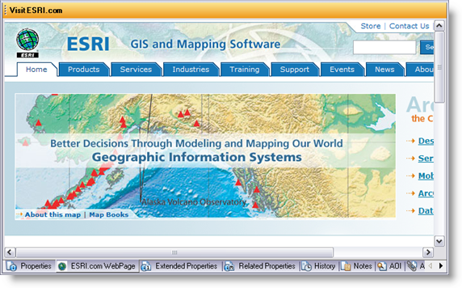

Adding a custom job tab

* * *

This sample shows how to extend the ArcGIS Workflow Manager client application with your own tab. <spaces> </spaces>In the sample, the new job tab shows ESRI.com. <spaces> </spaces>Job tabs can be created to open portals into other applications or show job information in a specific way.

<table x-use-null-cells="" style="x-cell-content-align: top; width: 50%; border-spacing: 0px; border-spacing: 0px;" cellspacing="0" width="50%"><colgroup><col style="width: 50%;"> <col style="width: 50%;"></colgroup>

<tbody>

<tr style="x-cell-content-align: top;" valign="top">

<td style="width: 50%; padding-right: 10px; padding-bottom: 4px; padding-top: 4px;
	padding-left: 10px; background-color: #c0c0c0; border-top-style: Solid;
	border-bottom-color: #808080; border-bottom-width: 1px; border-bottom-style: Solid;
	border-right-color: #808080; border-right-width: 1px; border-right-style: Solid;
	border-left-color: #808080; border-left-width: 1px; border-left-style: Solid;
	border-top-color: #808080; border-top-width: 1px;" bgcolor="#C0C0C0" width="50%">

Development licensing

</td>

<td style="width: 50%; padding-right: 10px; padding-left: 10px; padding-bottom: 3px;
	padding-top: 3px; background-color: #c0c0c0; border-top-style: Solid;
	border-bottom-color: #808080; border-bottom-width: 1px; border-bottom-style: Solid;
	border-top-color: #808080; border-top-width: 1px; border-right-color: #808080;
	border-right-width: 1px; border-right-style: Solid;" bgcolor="#C0C0C0" width="50%">

Deployment licensing

</td>

</tr>

<tr style="x-cell-content-align: top;" valign="top">

<td style="width: 50%; padding-right: 10px; padding-left: 10px; padding-bottom: 3px;
	padding-top: 3px; border-bottom-color: #808080; border-bottom-width: 1px;
	border-bottom-style: Solid; border-right-color: #808080; border-right-width: 1px;
	border-right-style: Solid; border-left-color: #808080; border-left-width: 1px;
	border-left-style: Solid;" width="50%">

ArcEditor: JTX

</td>

<td style="width: 50%; padding-right: 10px; padding-left: 10px; padding-bottom: 3px;
	padding-top: 3px; border-bottom-color: #808080; border-bottom-width: 1px;
	border-bottom-style: Solid; border-right-color: #808080; border-right-width: 1px;
	border-right-style: Solid;" width="50%">

ArcEditor: JTX

</td>

</tr>

<tr style="x-cell-content-align: top;" valign="top">

<td style="width: 50%; padding-right: 10px; padding-left: 10px; padding-bottom: 3px;
	padding-top: 3px; border-bottom-style: Solid; border-right-color: #808080;
	border-right-width: 1px; border-right-style: Solid; border-left-color: #808080;
	border-left-width: 1px; border-left-style: Solid; border-bottom-color: #808080;
	border-bottom-width: 1px;" width="50%">

ArcInfo: JTX

</td>

<td style="width: 50%; padding-right: 10px; padding-left: 10px; padding-bottom: 3px;
	padding-top: 3px; border-bottom-style: Solid; border-bottom-color: #808080;
	border-bottom-width: 1px; border-right-color: #808080; border-right-width: 1px;
	border-right-style: Solid;" width="50%">

ArcInfo: JTX

</td>

</tr>

</tbody>

</table>

How to use

1.  Open the solution using Visual Studio.

2.  Verify the references are still intact. It may be necessary to configure the JTXUI reference again.

3.  Compile the sample project.

Showing the new tab in the ArcGIS Workflow Manager Application

1.  Copy the compiled .dll from bin\debug\MyCustomJobTabs.dll to Workflow Manager Install Location\Bin.

2.  Edit Workflow Manager Install Location\config\jtxuiconfig.xml in a text editor or editor of your choice.

3.  Scroll till you find the <VIEWS> section and locate the start of the <JOB PANELS>.

4.  Add a new entry for your new job tab panel. <spaces> </spaces>Then end result will look something like the following:

 <implicit_p>

Additional information

The end result, is that you have a new job in the client application...

<implicit_p></implicit_p></implicit_p>
