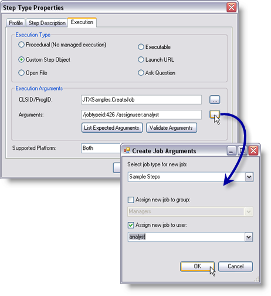

Create Job Custom Step

* * *
**Note**: Java custom steps are no longer supported starting in ArcGIS Workflow Manager 10.7.

Demonstrates how to create a new job and an implementation of an step argument editor.

<table x-use-null-cells="" style="x-cell-content-align: top; width: 50%; border-spacing: 0px; border-spacing: 0px;" cellspacing="0" width="50%"><colgroup><col style="width: 50%;"> <col style="width: 50%;"></colgroup>

<tbody>

<tr style="x-cell-content-align: top;" valign="top">

<td style="width: 50%; padding-right: 10px; padding-bottom: 4px; padding-top: 4px;
	padding-left: 10px; background-color: #c0c0c0; border-top-style: Solid;
	border-bottom-color: #808080; border-bottom-width: 1px; border-bottom-style: Solid;
	border-right-color: #808080; border-right-width: 1px; border-right-style: Solid;
	border-left-color: #808080; border-left-width: 1px; border-left-style: Solid;
	border-top-color: #808080; border-top-width: 1px;" bgcolor="#C0C0C0" width="50%">

Development licensing

</td>

<td style="width: 50%; padding-right: 10px; padding-left: 10px; padding-bottom: 3px;
	padding-top: 3px; background-color: #c0c0c0; border-top-style: Solid;
	border-bottom-color: #808080; border-bottom-width: 1px; border-bottom-style: Solid;
	border-top-color: #808080; border-top-width: 1px; border-right-color: #808080;
	border-right-width: 1px; border-right-style: Solid;" bgcolor="#C0C0C0" width="50%">

Deployment licensing

</td>

</tr>

<tr style="x-cell-content-align: top;" valign="top">

<td style="width: 50%; padding-right: 10px; padding-left: 10px; padding-bottom: 3px;
	padding-top: 3px; border-bottom-color: #808080; border-bottom-width: 1px;
	border-bottom-style: Solid; border-right-color: #808080; border-right-width: 1px;
	border-right-style: Solid; border-left-color: #808080; border-left-width: 1px;
	border-left-style: Solid;" width="50%">

ArcEditor: JTX

</td>

<td style="width: 50%; padding-right: 10px; padding-left: 10px; padding-bottom: 3px;
	padding-top: 3px; border-bottom-color: #808080; border-bottom-width: 1px;
	border-bottom-style: Solid; border-right-color: #808080; border-right-width: 1px;
	border-right-style: Solid;" width="50%">

ArcEditor: JTX

</td>

</tr>

<tr style="x-cell-content-align: top;" valign="top">

<td style="width: 50%; padding-right: 10px; padding-left: 10px; padding-bottom: 3px;
	padding-top: 3px; border-bottom-style: Solid; border-right-color: #808080;
	border-right-width: 1px; border-right-style: Solid; border-left-color: #808080;
	border-left-width: 1px; border-left-style: Solid; border-bottom-color: #808080;
	border-bottom-width: 1px;" width="50%">

ArcInfo: JTX

</td>

<td style="width: 50%; padding-right: 10px; padding-left: 10px; padding-bottom: 3px;
	padding-top: 3px; border-bottom-style: Solid; border-bottom-color: #808080;
	border-bottom-width: 1px; border-right-color: #808080; border-right-width: 1px;
	border-right-style: Solid;" width="50%">

ArcInfo: JTX

</td>

</tr>

</tbody>

</table>

Where to Find it

JTX Install Location\Developer Kit\Samples\Custom Steps\CreateJob

How to use

1.  Update the build.xml build script to set your ArcGIS Workflow Manager directory correctly in the classpath

2.  Use Ant to run the build.xml build script

3.  Deploy the resulting CreateJob.jar file to <ArcGIS Install Location>\Java\lib\ext

4.  Open the ArcGIS Workflow Manager Administrator.

5.  Create a new Step Type.

6.  Give the new step type a name and change any other Profile information you want to.

7.  Select the Execution Tab.

8.  Choose Custom Step Object.

9.  Click the browse button next to the CLSID\ProgID text box.

10.  Expand the JTXJavaSteps library on the Registered Steps tab.

11.  Your new CreateJob class should be presented; select it then click OK.

12.  Configure the necessary arguments for this custom step. For example:

/jobtypeid:426 /assignuser:analyst

14.  Alternatively, use the argument editor to define the step arguments.

<implicit_p>
*   Click Ok to save your new step type.

*   Add the new step type to a workflow, then open the client application and run it.

    </implicit_p>
